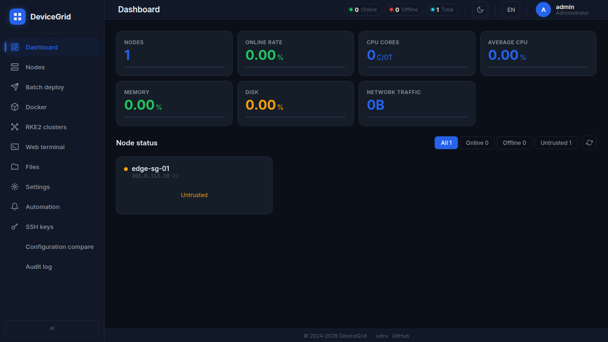

# DeviceGrid

[English](README.md) | [简体中文](README.zh-CN.md)

**一个为你现有服务器而生的实用控制平面。**

DeviceGrid 将节点清单、实时健康数据、远程访问、Docker 运维、批量部署以及
RKE2 工作流整合到一个自托管的 Web 应用中。你可以通过 SSH 管理小型实验室或不断扩容的
服务器集群，并在需要持久 mTLS 连接时，按需部署轻量级 Agent。



[](https://go.dev/)
[](https://vuejs.org/)
[](LICENSE)

## 核心能力

- 在统一的仪表盘中查看整个集群的健康状态、容量与连通性。
- 通过浏览器终端访问服务器，并使用内置 SFTP 文件管理器。
- 管理 Docker 容器、镜像、网络、存储卷、Compose 项目以及日志。
- 在选中的节点上批量执行脚本与软件包安装，并查看实时输出。
- 创建并运维 RKE2 集群，包括部署前检查与滚动升级。
- 通过基于角色的访问控制，自动化周期任务、告警与审计记录。
- 在应用顶部切换中英文界面，所选语言会保存在本地。

## 快速开始

### 使用发布包安装

```bash
sudo dpkg -i devicegrid-*.deb
sudo systemctl enable --now devicegrid
```

随后打开 `http://<服务器 IP>:3000`，使用 `admin` / `admin123` 登录。
请立即修改默认密码。

### 从源码构建

```bash
git clone https://github.com/ColorDanio/DeviceGrid.git
cd DeviceGrid
make package
./bin/devicegrid-server
```

`make package` 会构建 Vue 应用、将其嵌入服务端二进制文件，并生成 Agent
二进制文件。默认配置监听 `3000` 端口。

## 选择连接模式

| 模式 | 适用场景 |
| --- | --- |
| SSH | 快速上手，或管理不希望安装额外软件的主机 |
| Agent | 需要持久、受 mTLS 保护的连接，且希望降低 SSH 开销 |

建议从 SSH 起步。当某个节点被信任后，可在节点详情页部署 Agent，通过 DeviceGrid
的 gRPC 隧道保持长连接。

## 文档

- [运维指南](docs/OPERATIONS.md)：安装、配置、开发以及 Agent 部署说明。
- [系统架构](ARCHITECTURE.md)：系统组件、传输层、数据流与安全模型。
- [技术规格](SPEC.md)：完整的功能与 API 契约。
- [项目计划](PLAN.md)：交付路线图。
- [贡献指南](AGENTS.md)：仓库约定与校验命令。

## 许可证

MIT，详见 [LICENSE](LICENSE)。
